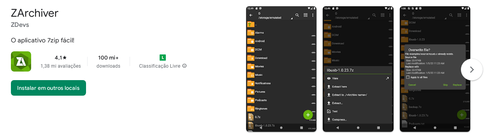
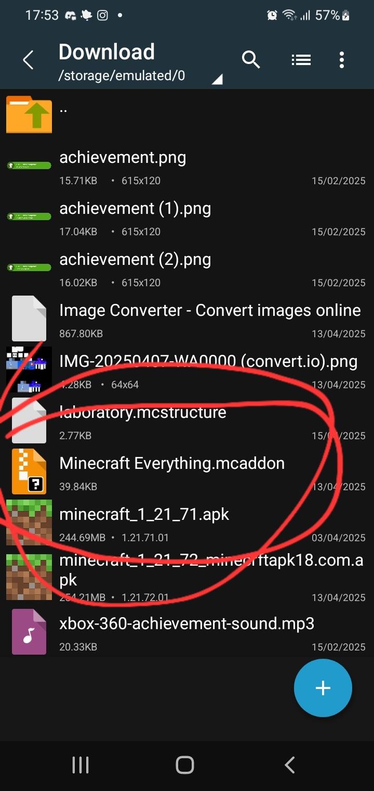

# Minecraft Everything

## How to download

### Computer/PC

This is simple, on PC (Windows, Mac or Linux), you can download the .mcaddon file on [GitHub releases](https://github.com/esdraslov/Minecraft-Everything/releases) and double click it, this will work if you have Minecraft Launcher and Minecraft Bedrock installed.

### Mobile (Android)

1. On mobile, things get more complex, firstly, you must have [ZArchiver](https://play.google.com/store/apps/details?id=ru.zdevs.zarchiver)

2. After you install, download the .mcaddon file on [GitHub releases](https://github.com/esdraslov/Minecraft-Everything/releases) and search it on your device via ZArchiver, oftenly inside Download folder

3. Hold the file and click "move" or something like this (sorry if it isn't "move", just guessing since I am brazillian)
4. Move to Android/data/com.mojang.minecraftpe (click the "..." folder before)
5. Hold the file and click the diagonal arrow
6. Find "Minecraft"

And you done installing Minecraft Everything!

## Experiments

Minecraft Everything requires **2 experiments**:
1. Beta APIs
2. Custom Biomes

This is very important since without *Beta APIs*, some items will not work and without *Custom Biomes*, well, you know, custom biomes can't spawn.
